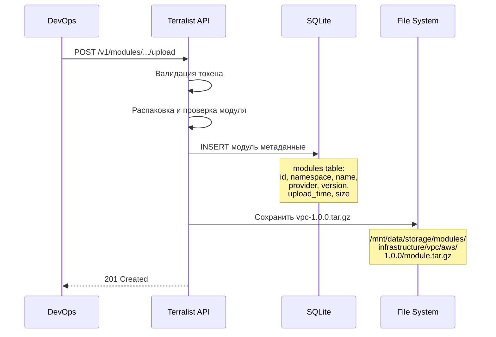
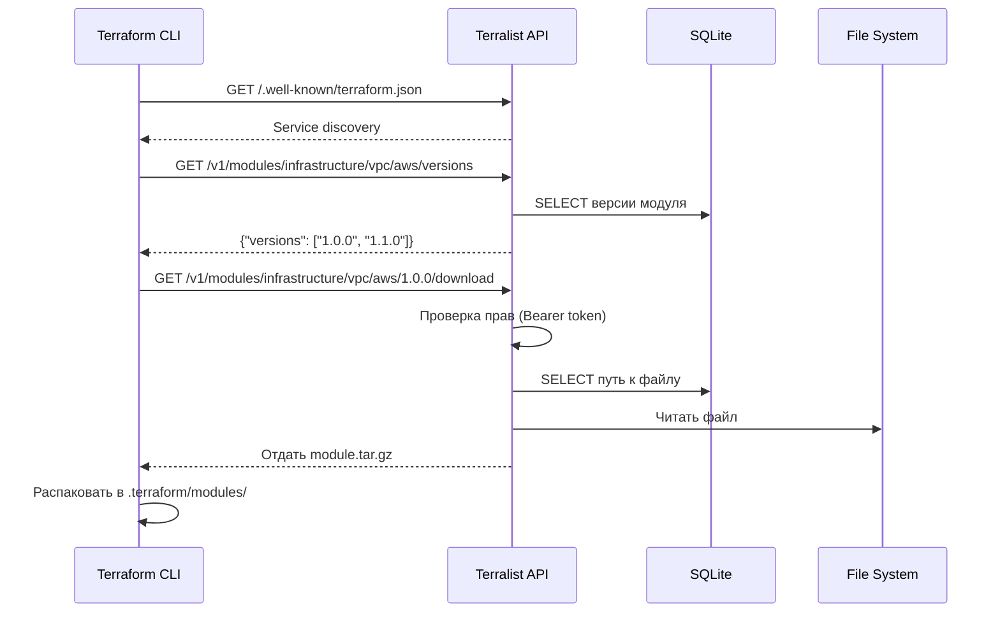

# Пошаговый пример работы Terralist с local storage

## Шаг 1: DevOps создает модуль VPC

```bash
# Структура модуля
vpc-module/
├── main.tf
├── variables.tf
├── outputs.tf
├── README.md
└── examples/
    └── simple/
        └── main.tf
```

**main.tf:**
```hcl
resource "aws_vpc" "main" {
  cidr_block = var.cidr_block
  
  tags = {
    Name = var.name
    Environment = var.environment
  }
}

resource "aws_subnet" "public" {
  count = length(var.public_subnets)
  
  vpc_id     = aws_vpc.main.id
  cidr_block = var.public_subnets[count.index]
  
  tags = {
    Name = "${var.name}-public-${count.index + 1}"
  }
}
```

## Шаг 2: Загрузка модуля в Terralist

```bash
# Создание архива
cd vpc-module
tar -czf ../vpc-1.0.0.tar.gz .

# Загрузка через API
curl -X POST https://terralist.company.com/v1/modules/infrastructure/vpc/aws/1.0.0/upload \
  -H "Authorization: Bearer YOUR_API_KEY" \
  -F "file=@../vpc-1.0.0.tar.gz"

# Ответ:
{
  "namespace": "infrastructure",
  "name": "vpc",
  "provider": "aws",
  "version": "1.0.0",
  "status": "uploaded",
  "download_url": "https://terralist.company.com/v1/modules/infrastructure/vpc/aws/1.0.0/download"
}
```

## Шаг 3: Что происходит внутри Terralist



## Шаг 4: Developer использует модуль

**terraform/production/main.tf:**
```hcl
# Настройка credentials
# ~/.terraformrc
credentials "terralist.company.com" {
  token = "developer-api-token"
}

# Использование модуля
module "production_vpc" {
  source  = "terralist.company.com/infrastructure/vpc/aws"
  version = "1.0.0"
  
  name           = "prod-vpc"
  environment    = "production"
  cidr_block     = "10.0.0.0/16"
  public_subnets = ["10.0.1.0/24", "10.0.2.0/24"]
}
```

## Шаг 5: Процесс при terraform init

```bash
$ terraform init

Initializing modules...
Downloading terralist.company.com/infrastructure/vpc/aws 1.0.0 for production_vpc...
```

**Что происходит:**



## Шаг 6: Структура на диске Terralist

```bash
/mnt/data/
├── terralist.db                           # SQLite база
│   └── tables:
│       ├── modules (id, namespace, name, provider, version, path)
│       ├── users (id, email, api_key)
│       └── downloads (id, module_id, user_id, timestamp)
│
└── storage/                               # Локальное хранилище
    ├── modules/
    │   ├── infrastructure/
    │   │   ├── vpc/
    │   │   │   └── aws/
    │   │   │       ├── 1.0.0/
    │   │   │       │   └── module.tar.gz  # 2.1 MB
    │   │   │       └── 1.1.0/
    │   │   │           └── module.tar.gz  # 2.3 MB
    │   │   └── kubernetes/
    │   │       └── eks/
    │   │           └── aws/
    │   │               └── 2.0.0/
    │   │                   └── module.tar.gz
    │   └── applications/
    │       └── frontend/
    │           └── docker/
    │               └── 1.0.0/
    │                   └── module.tar.gz
    └── providers/
        └── custom/
            └── monitoring/
                └── 1.0.0/
                    └── provider.tar.gz
```

## Шаг 7: Обновление модуля

```bash
# DevOps обновляет модуль
cd vpc-module
# ... изменения в коде ...
tar -czf ../vpc-1.1.0.tar.gz .

# Загружает новую версию
curl -X POST https://terralist.company.com/v1/modules/infrastructure/vpc/aws/1.1.0/upload \
  -H "Authorization: Bearer YOUR_API_KEY" \
  -F "file=@../vpc-1.1.0.tar.gz"
```

**Developer обновляет:**
```hcl
module "production_vpc" {
  source  = "terralist.company.com/infrastructure/vpc/aws"
  version = "1.1.0"  # Обновлена версия
  # ...
}
```

```bash
$ terraform init -upgrade
Downloading terralist.company.com/infrastructure/vpc/aws 1.1.0 for production_vpc...
- production_vpc in .terraform/modules/production_vpc
```

## Преимущества local storage:

1. **Полный контроль** - модули физически на вашем PVC
2. **Быстрый доступ** - нет сетевых задержек к S3
3. **Простой backup** - копирование всего PVC
4. **Нет зависимостей** - работает без интернета
5. **Прозрачность** - можно посмотреть файлы напрямую

## Когда пора на S3:

- PVC заполнен на 80%+
- Нужен доступ из разных регионов
- Модулей больше 200-300
- Размер модулей > 10GB суммарно
- Нужна репликация