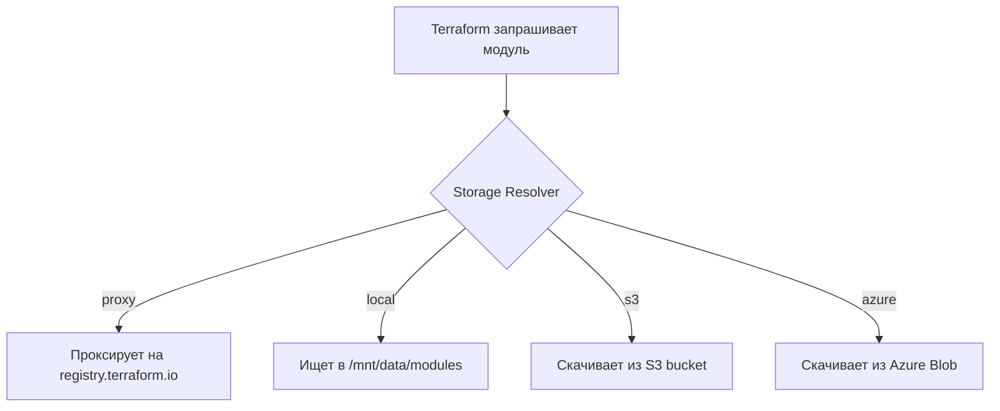

# Storage Resolvers в Terralist - Полное объяснение

## Что это такое?

Storage Resolvers определяют, **где и как** Terralist хранит и получает модули/провайдеры.

## Типы Storage Resolvers:

### 1. `proxy` (по умолчанию)
- **Что делает**: Проксирует запросы к официальному Terraform Registry
- **Когда использовать**: Когда вы хотите кэшировать официальные модули
- **Хранение**: Не хранит локально, только проксирует
- **Пример**: Запрос модуля `hashicorp/consul/aws` идет на registry.terraform.io

```yaml
env:
  - name: TERRALIST_MODULES_STORAGE_RESOLVER
    value: "proxy"
  # Terralist будет проксировать запросы к registry.terraform.io
```

### 2. `local` 
- **Что делает**: Хранит модули локально в файловой системе
- **Когда использовать**: Для приватных модулей вашей компании
- **Хранение**: На диске (в вашем случае на PVC)
- **Путь**: По умолчанию `/tmp`, но лучше указать свой

```yaml
env:
  - name: TERRALIST_MODULES_STORAGE_RESOLVER
    value: "local"
  - name: TERRALIST_LOCAL_STORE
    value: "/mnt/data/modules"  # Путь на PVC
```

### 3. `s3`
- **Что делает**: Хранит модули в S3-совместимом хранилище
- **Когда использовать**: Для production с большим количеством модулей
- **Хранение**: В S3 bucket
- **Преимущества**: Неограниченный размер, репликация, CDN

```yaml
env:
  - name: TERRALIST_MODULES_STORAGE_RESOLVER
    value: "s3"
  - name: TERRALIST_S3_BUCKET_NAME
    value: "my-terralist-modules"
  # + другие S3 параметры
```

### 4. `azure`
- **Что делает**: Хранит модули в Azure Blob Storage
- **Когда использовать**: Если инфраструктура в Azure
- **Хранение**: В Azure контейнере

## Как это работает?



## Ваш текущий случай (без явного указания):

Если вы НЕ указали `TERRALIST_MODULES_STORAGE_RESOLVER`, то:
- По умолчанию используется `proxy`
- Модули НЕ сохраняются локально
- Terralist работает как прокси

## Рекомендация для вас:

Добавьте в ваш StatefulSet:

```yaml
env:
  # ... существующие переменные ...
  
  # Включаем локальное хранение
  - name: TERRALIST_MODULES_STORAGE_RESOLVER
    value: "local"
  - name: TERRALIST_PROVIDERS_STORAGE_RESOLVER
    value: "local"
  - name: TERRALIST_LOCAL_STORE
    value: "/mnt/data/terralist-storage"
```

И обновите init container:

```yaml
initContainers:
- name: init-permissions
  image: busybox:1.35
  command: ['sh', '-c']
  args:
    - |
      # Создаем директории для хранения
      mkdir -p /mnt/data/terralist-storage/modules
      mkdir -p /mnt/data/terralist-storage/providers
      chmod -R 777 /mnt/data/terralist-storage
      
      # База данных
      mkdir -p /mnt/data
      chmod 777 /mnt/data
      if [ -f /mnt/data/terralist.db ]; then
        chmod 666 /mnt/data/terralist.db
      fi
```

## Проверка текущих настроек:

```bash
# Проверить какой resolver используется
kubectl exec -n terralist terralist-0 -- env | grep STORAGE_RESOLVER

# Если пусто - значит используется proxy (по умолчанию)
```

## Важно:

1. **Без указания resolver = proxy** - модули не сохраняются!
2. **Для приватных модулей нужен local или s3**
3. **local подходит для начала, s3 - для production**