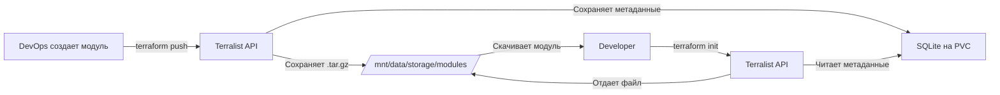
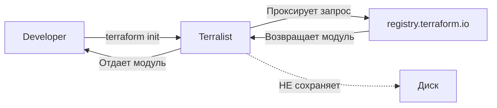

# Кейсы использования Terralist с разными Storage Resolvers

## Кейс 1: Приватный Registry с локальным хранением (ваш случай)

### Сценарий:
Компания хочет хранить свои приватные Terraform модули и не делиться ими публично.

### Настройка:
```yaml
env:
  - name: TERRALIST_MODULES_STORAGE_RESOLVER
    value: "local"
  - name: TERRALIST_LOCAL_STORE
    value: "/mnt/data/storage"
```

### Как это работает:



### Пример использования:

1. **DevOps загружает модуль:**
```bash
# Создание модуля vpc
cd modules/vpc
tar -czf vpc-1.0.0.tar.gz *.tf README.md

# Загрузка в Terralist
curl -X POST https://terralist.company.com/v1/modules/infrastructure/vpc/aws/1.0.0/upload \
  -H "Authorization: Bearer API_KEY" \
  -F "file=@vpc-1.0.0.tar.gz"
```

2. **Файл сохраняется:**
```
/mnt/data/
├── terralist.db                    # Метаданные о модуле
└── storage/
    └── modules/
        └── infrastructure/
            └── vpc/
                └── aws/
                    └── 1.0.0/
                        └── module.tar.gz   # Сам модуль
```

3. **Developer использует:**
```hcl
# main.tf
module "vpc" {
  source  = "terralist.company.com/infrastructure/vpc/aws"
  version = "1.0.0"
  
  cidr_block = "10.0.0.0/16"
  region     = "eu-central-1"
}
```

4. **При terraform init:**
- Terraform обращается к Terralist
- Terralist проверяет права доступа (API key)
- Читает из SQLite где лежит файл
- Отдает файл из `/mnt/data/storage/modules/...`
- Terraform скачивает и распаковывает

## Кейс 2: Proxy для публичных модулей

### Сценарий:
Компания хочет кэшировать публичные модули из registry.terraform.io

### Настройка:
```yaml
env:
  - name: TERRALIST_MODULES_STORAGE_RESOLVER
    value: "proxy"
```

### Как это работает:



### Пример:
```hcl
# Developer запрашивает публичный модуль через ваш Terralist
module "vpc" {
  source  = "terralist.company.com/terraform-aws-modules/vpc/aws"
  version = "3.14.0"
}
```
- Terralist получает запрос
- Проксирует его на registry.terraform.io
- Возвращает модуль developer'у
- НЕ сохраняет локально

## Кейс 3: Гибридный подход (рекомендую)

### Сценарий:
- Свои модули храним локально
- Публичные модули проксируем

### Настройка (требует кастомизации Terralist):
```yaml
env:
  # Для модулей с префиксом "internal/" - local
  - name: TERRALIST_MODULES_STORAGE_RESOLVER
    value: "local"
  # Для остальных - proxy
  - name: TERRALIST_PUBLIC_MODULES_PROXY
    value: "true"
```

## Кейс 4: Production с S3

### Сценарий:
Большая компания с сотнями модулей и глобальными командами

### Настройка:
```yaml
env:
  - name: TERRALIST_MODULES_STORAGE_RESOLVER
    value: "s3"
  - name: TERRALIST_S3_BUCKET_NAME
    value: "company-terraform-modules"
  - name: TERRALIST_S3_BUCKET_REGION
    value: "eu-central-1"
```

### Преимущества:
- Неограниченное хранилище
- CDN для быстрой загрузки
- Репликация между регионами
- Версионирование S3

### Структура в S3:
```
s3://company-terraform-modules/
├── modules/
│   ├── infrastructure/vpc/aws/1.0.0/module.tar.gz
│   ├── infrastructure/vpc/aws/1.1.0/module.tar.gz
│   └── apps/frontend/docker/2.0.0/module.tar.gz
└── providers/
    └── custom/monitoring/1.0.0/provider.tar.gz
```

## Миграция между storage типами

### Из local в S3:
```bash
# 1. Копируем файлы
aws s3 sync /mnt/data/storage/ s3://new-bucket/

# 2. Меняем конфигурацию
kubectl set env statefulset/terralist \
  TERRALIST_MODULES_STORAGE_RESOLVER=s3 \
  TERRALIST_S3_BUCKET_NAME=new-bucket

# 3. Перезапускаем
kubectl rollout restart statefulset/terralist
```

## Рекомендации по выбору:

| Сценарий | Storage Resolver | Почему |
|----------|-----------------|--------|
| < 50 модулей, одна команда | local + PVC | Просто и достаточно |
| Нужны публичные модули | proxy | Не засоряем диск |
| 50-500 модулей | local + большой PVC | Еще справляется |
| > 500 модулей или глобальные команды | S3 | Масштабируемость |
| Compliance требования | local или S3 с шифрованием | Контроль данных |

## Мониторинг использования:

```bash
# Для local storage
kubectl exec terralist-0 -- du -sh /mnt/data/storage/
kubectl exec terralist-0 -- find /mnt/data/storage -type f | wc -l

# Проверка что работает
kubectl logs terralist-0 | grep -i "storage resolver"
```